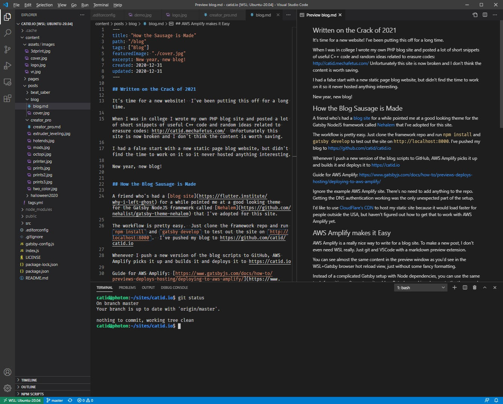

## Written on the Crack of 2021

It's time for a new website!  I've been putting this off for a long time.

When I was in college I wrote my own PHP blog site and posted a lot of short snippets of useful C++ code and random ideas related to erasure codes: http://catid.mechafetus.com/  Unfortunately this site is now broken and I don't think the content is worth saving.

I had a false start with a new static page blog website, but didn't find the time to work on it so it never hosted anything interesting.

New year, new blog!

## How the Blog Sausage is Made

A friend who's had a [blog site](https://flutter.institute/why-i-left-ghost) for a while pointed me at a good looking theme for the Gatsby NodeJS framework called [Nehalem](https://github.com/nehalist/gatsby-theme-nehalem) that I've adopted for this site.

The workflow is pretty easy.  Just clone the framework repo and run `npm install` and `gatsby develop` to test out the site on `http://localhost:8000`.  I've pushed my blog to https://github.com/catid/catid.io

Whenever I push a new version of the blog scripts to GitHub, AWS Amplify picks it up and builds it and deploys it to https://catid.io

Guide for AWS Amplify: [https://www.gatsbyjs.com/docs/how-to/previews-deploys-hosting/deploying-to-aws-amplify/](https://www.gatsbyjs.com/docs/how-to/previews-deploys-hosting/deploying-to-aws-amplify/)

Ignore the example AWS Amplify site.  There's no need to add anything to the repo.  Getting the DNS authentication working was the only unexpected part of the setup.

I'd like to use [CloudFlare's CDN](https://www.cloudflare.com/network/) to host my static site because it would load faster for people outside the USA, but haven't figured out how to get that to work with AWS Amplify yet.

## AWS Amplify makes it Easy

AWS Amplify is a really nice way to write for a blog site.  To make a new post, I don't even need WSL really.  Just git and VSCode with a markdown preview extension.

You can see almost the same content in the preview window as you'd see in the WSL+Gatsby browser hot reload view, just without some fancy formatting.

Instead of a complicated Gatsby setup with Node dependencies, you can use the same tools for writing software to write a blog.  But when making changes to the theme and other areas of the site than just writing a new post, it's important to be able to locally test changes to iterate faster and find/fix syntax errors.

## Gatsby on Windows

### The way to go: WSL2, Ubuntu app, Visual Studio Code

I'm using Windows for development, which is a fantastic platform these days especially since WSL was introduced.  To set up an Ubuntu filesystem and shell, all you have to do is install the Ubuntu app from the Microsoft Store.  I used to use Git Bash before this but it was far more flaky.

WSL install Windows 10 and upgrade to WSL2: [https://docs.microsoft.com/en-us/windows/wsl/install-win10](https://docs.microsoft.com/en-us/windows/wsl/install-win10)

After installing Ubuntu I had to fix one bug in the default scripts.  Fix hostname resolution bug in WSL2: [https://github.com/microsoft/WSL/issues/5420](https://github.com/microsoft/WSL/issues/5420)

And then I'm able to edit the blog code using Visual Studio Code by just typing `code .` in the git checkout, and it pops up in my familiar editor of choice.

The `gatsby develop` command frequently fails randomly and needs to be restarted.

Also VSCode often does not launch and I need to click `Retry` a few times to get it to connect.
